# Magic Caster Wand Spell Gestures

<table>
  <tr>
    <td align="center"><b>Aberto</b> 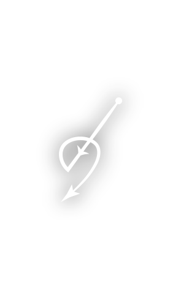</td>
    <td align="center"><b>Accio</b> 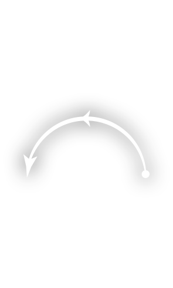</td>
    <td align="center"><b>Aguamenti</b> 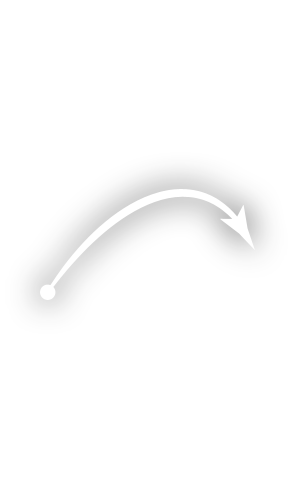</td>
    <td align="center"><b>Alohomora</b> 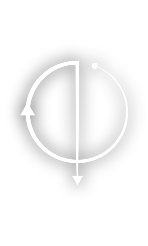</td>
  </tr>
  <tr>
    <td align="center"><b>Anteoculatia</b> 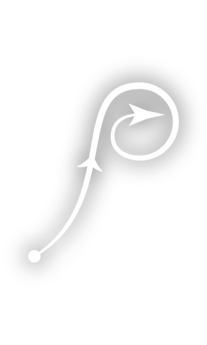</td>
    <td align="center"><b>Appare Vestigium</b> </td>
    <td align="center"><b>Arania Exumai</b> 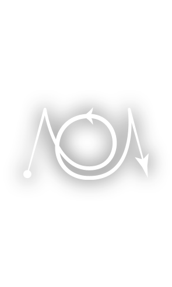</td>
    <td align="center"><b>Ascendio</b> 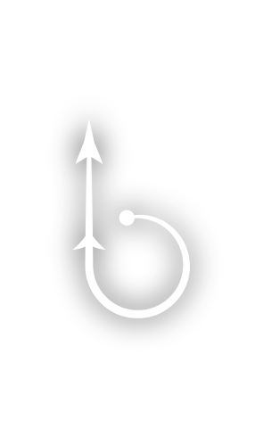</td>
  </tr>
  <tr>
    <td align="center"><b>Bombarda</b> 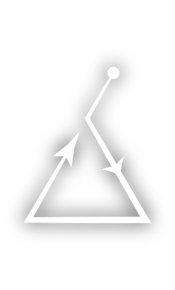</td>
    <td align="center"><b>Brachiabindo</b> 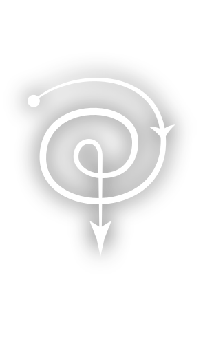</td>
    <td align="center"><b>Calvorio</b> 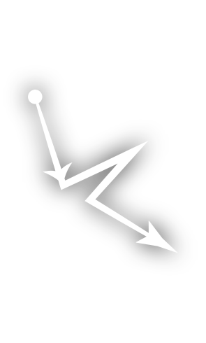</td>
    <td align="center"><b>Cantis</b> 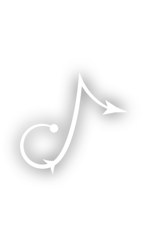</td>
  </tr>
  <tr>
    <td align="center"><b>Colloportus</b> 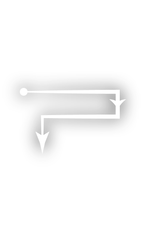</td>
    <td align="center"><b>Colloshoo</b> 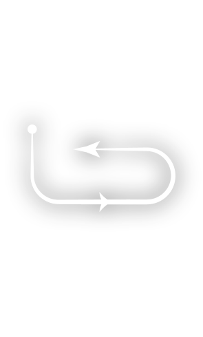</td>
    <td align="center"><b>Colovaria</b> </td>
    <td align="center"><b>Confringo</b> </td>
  </tr>
  <tr>
    <td align="center"><b>Confundo</b> 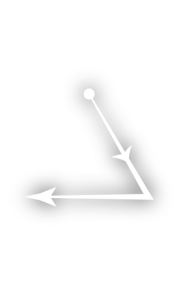</td>
    <td align="center"><b>Densaugeo</b> 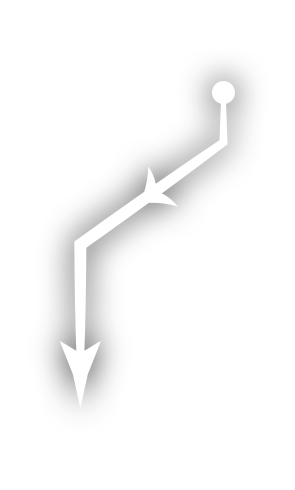</td>
    <td align="center"><b>Entomorphis</b> </td>
    <td align="center"><b>Evanesco</b> 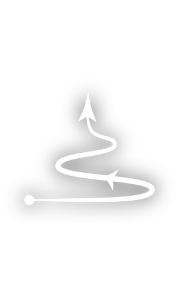</td>
  </tr>
  <tr>
    <td align="center"><b>Expecto Patronum</b> 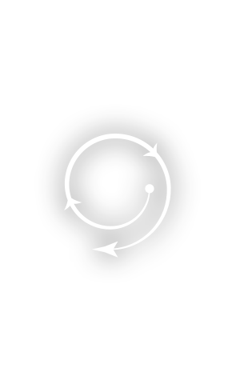</td>
    <td align="center"><b>Expelliarmus</b> 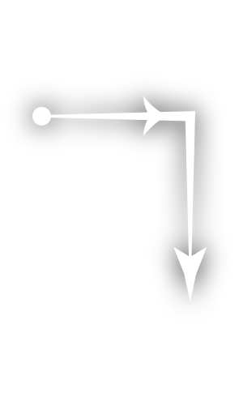</td>
    <td align="center"><b>Expulso</b> 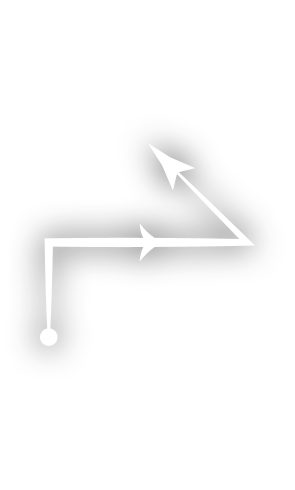</td>
    <td align="center"><b>Finestra</b> 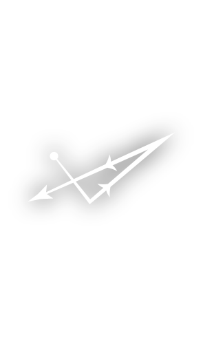</td>
  </tr>
  <tr>
    <td align="center"><b>Finite</b> 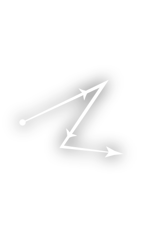</td>
    <td align="center"><b>Flagrate</b> </td>
    <td align="center"><b>Flipendo</b> 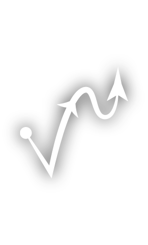</td>
    <td align="center"><b>Fulgari</b> 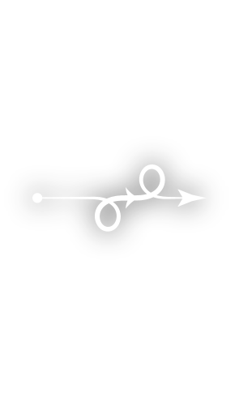</td>
  </tr>
  <tr>
    <td align="center"><b>Glacius</b> </td>
    <td align="center"><b>Herbivicus</b> 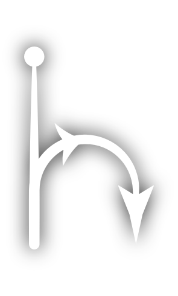</td>
    <td align="center"><b>Immobulus</b> </td>
    <td align="center"><b>Impedimenta</b> 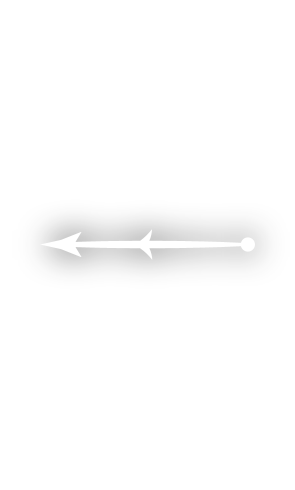</td>
  </tr>
  <tr>
    <td align="center"><b>Incarcerous</b> 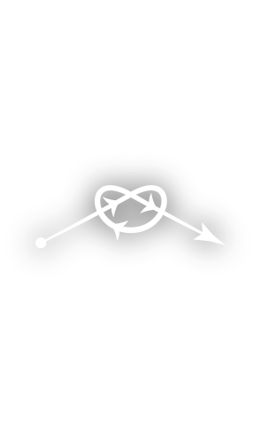</td>
    <td align="center"><b>Incendio</b> </td>
    <td align="center"><b>Lumos</b> 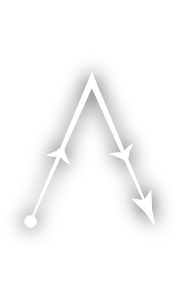</td>
    <td align="center"><b>Lumos Maxima</b> 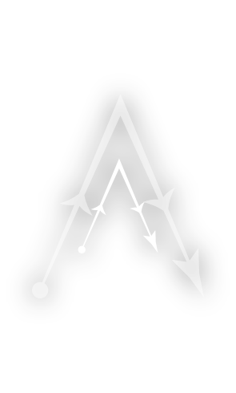</td>
  </tr>
  <tr>
    <td align="center"><b>Melefors</b> </td>
    <td align="center"><b>Meteolojinx</b> 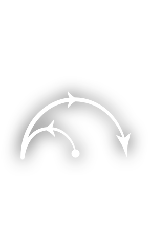</td>
    <td align="center"><b>Mucus Ad Nauseum</b> 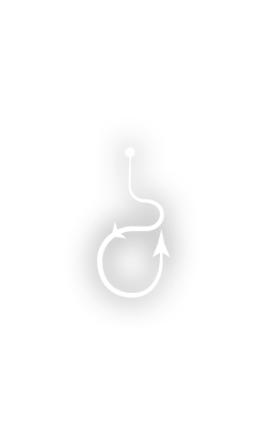</td>
    <td align="center"><b>Nox</b> 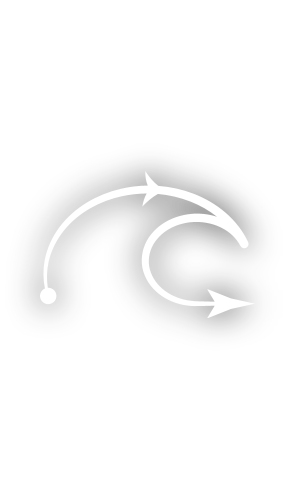</td>
  </tr>
  <tr>
    <td align="center"><b>Orchideous</b> 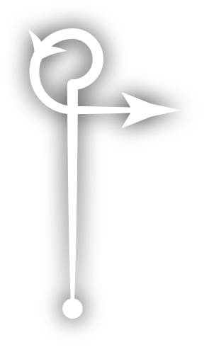</td>
    <td align="center"><b>Petrificus Totalus</b> 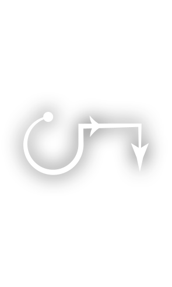</td>
    <td align="center"><b>Piertotum Locomotor</b> 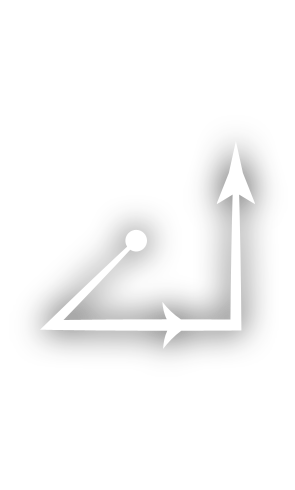</td>
    <td align="center"><b>Protego</b> 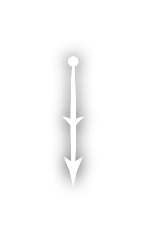</td>
  </tr>
  <tr>
    <td align="center"><b>Quietus</b> 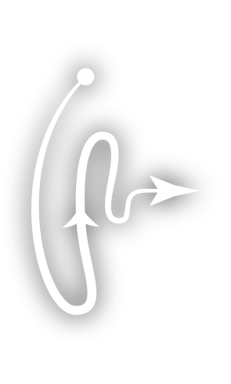</td>
    <td align="center"><b>Reducto</b> 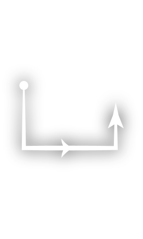</td>
    <td align="center"><b>Reparo</b> 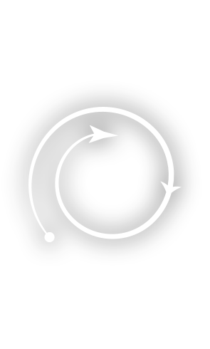</td>
    <td align="center"><b>Revelio</b> 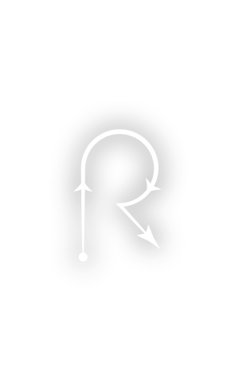</td>
  </tr>
  <tr>
    <td align="center"><b>Rictusempra</b> </td>
    <td align="center"><b>Riddikulus</b> 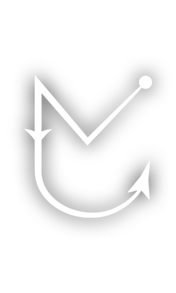</td>
    <td align="center"><b>Salvio Hexia</b> </td>
    <td align="center"><b>Scourgify</b> 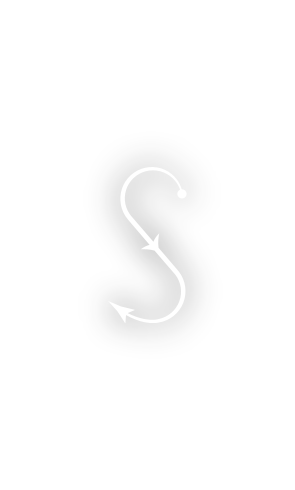</td>
  </tr>
  <tr>
    <td align="center"><b>Silencio</b> 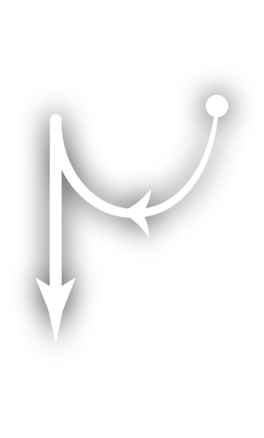</td>
    <td align="center"><b>Stupefy</b> 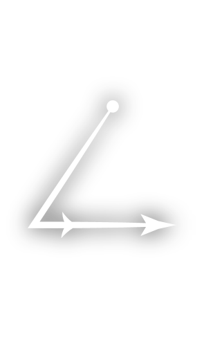</td>
    <td align="center"><b>The Cheering Charm</b> 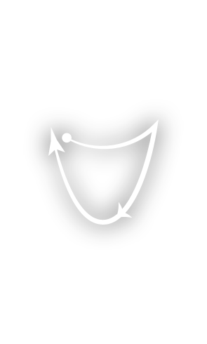</td>
    <td align="center"><b>The Force Spell</b> 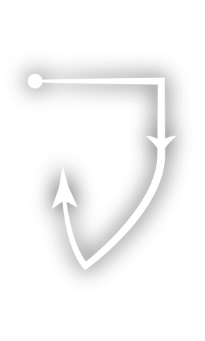</td>
  </tr>
  <tr>
    <td align="center"><b>The Hair Thickening Growing Charm</b> </td>
    <td align="center"><b>The Hour Reversal Charm</b> 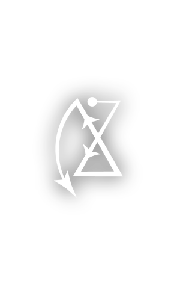</td>
    <td align="center"><b>The Sleeping Charm</b> 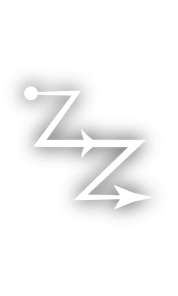</td>
    <td align="center"><b>The Spell Thickening Charm</b> </td>
  </tr>
  <tr>
    <td align="center"><b>The Stretching Jinx</b> 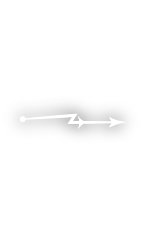</td>
    <td align="center"><b>Ventus</b> 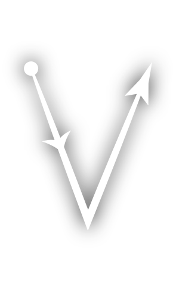</td>
    <td align="center"><b>Verdimillious</b> 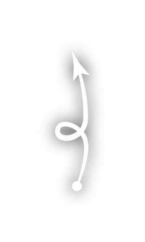</td>
    <td align="center"><b>Vermillious</b> </td>
  </tr>
  <tr>
    <td align="center"><b>Wingardium Leviosa</b> </td>
    <td></td>
    <td></td>
    <td></td>
  </tr>
</table>
